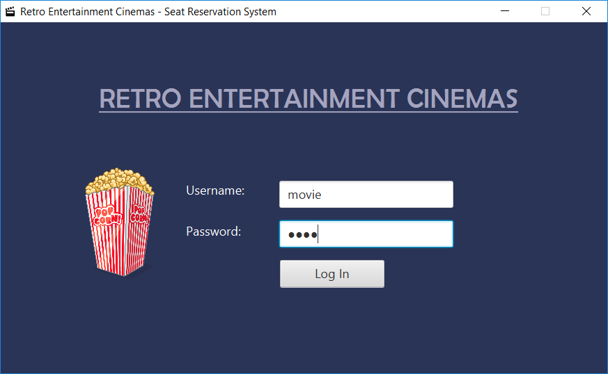
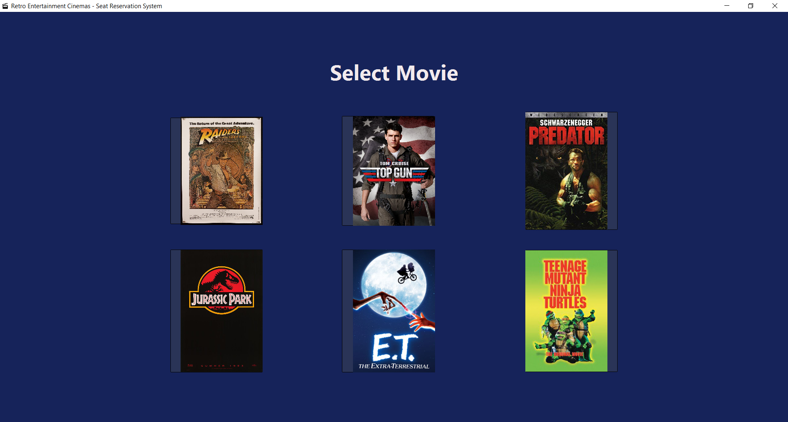
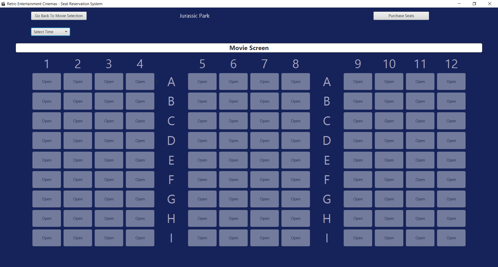
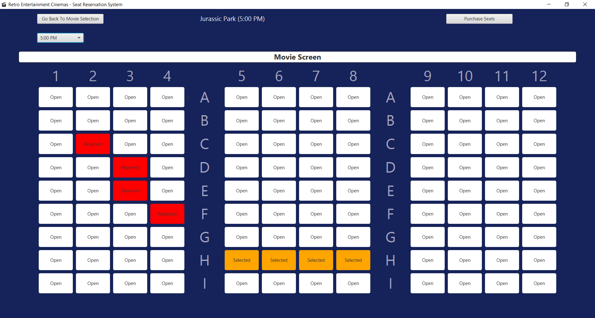
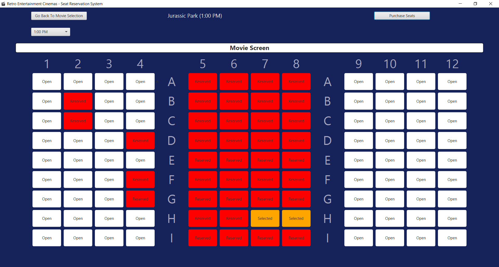

# Retro-Cinemas-Movie-Reservation
Side-project for saving seat reservations. This project utilizes Java and JavaFX/FXML using an OOP approach to storing the movie and theater data. 

I worked on this as a side project to familiarize myself more with JavaFX and FXML (using ScreenBuilder). 

It was excellent practice for this reason and such techniques learned here will absolutely apply to real-world client needs for
an automated application for such industries as: movie theaters, bus tickets, concert tickets, and even airline tickets.

There are a few things that I want to still change/update so that the application is more "automated" for the end-user.

As this application stands now, it is more than functional and can be modified further to give it real appliance to real world problems.

Several updates will be pending in the future. First and foermost I want the process of using
this application to be even more "automated." Possibly modifying further to connect to a stable SQL relational database.

Also I plan to provide an update that includes printing a fictional receipt for the user as a .txt file. 
Perhaps even a check-out section to charge the customer.

****REQUIRED INFORMATION****
To simplify the log in process use "movie" as the username and "time" as the password.

Modification is required in the source code in the file - SeatSelectionController.java.

Lines ~245 (filename variable) and ~437 (file variable) need to be changed to a directory of your choice for the saving and loading feature to work.
Otherwise, complications may arise where reserved seats are not processed upon launch of the application where they should have been saved
from earlier use.

Thanks for looking,

Thomas O.

APPLICATION OUTPUT IMAGES

